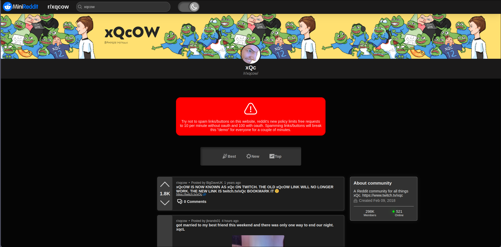
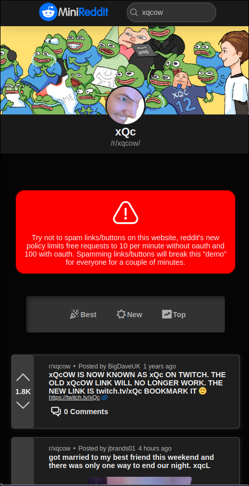

  

# MiniReddit
 [Codecademy](https://www.codecademy.com/) practice project for the Full-Stack course.

## Running a development build locally

Requirements: [Node.js 18^](https://nodejs.org/en)
1. `git clone https://github.com/WoltEye/MiniReddit.git`
2. `cd MiniReddit`
3. `npm i`
4. `npm run dev`

## Known issues
- Markdown support isn't the best right now, its really buggy.
- All comment replies are not visible. *(This issue will not be fixed. The "missing" comments need a extra fetch request which would make the app even more easy to break because of [reddit's new api policy](https://www.reddit.com/r/redditdev/comments/14nbw6g/updated_rate_limits_going_into_effect_over_the/))*
- The app is really easy to break and its very unstable due to [reddit's new api policy](https://www.reddit.com/r/redditdev/comments/14nbw6g/updated_rate_limits_going_into_effect_over_the) x2 :)

## Fully Responsive Layout
Fully responsive layout that supports all screen sizes

## Technologies used
- [React](https://react.dev/)
- [Redux](https://redux.js.org/)
- [React Router](https://reactrouter.com/en/main)
### Additional packages
- [React-Markdown](https://github.com/remarkjs/react-markdown)
- [Interweave](https://www.npmjs.com/package/interweave)
- [Remark-gfm](https://github.com/remarkjs/remark-gfm)
- [MomentJS](https://momentjs.com/)
- [ReactHlsPlayer](https://www.npmjs.com/package/react-hls-player)

## What did I learn from this project?
How important writing tests really is, this project used to have tests but "they were too boring to make" and I completely removed them which was a huge mistake at the end the project was a lot more complex than I had planned and it was impossible to test that everything works like it should. I also learned that you shouldn't use useEffect everywhere, I used it for every fetch request in this project and it was a HUGE mistake, I spent many days fixing issues that useEffect caused.

## Demo site
[wolteyeminireddit.netlify.app](https://wolteyeminireddit.netlify.app/)